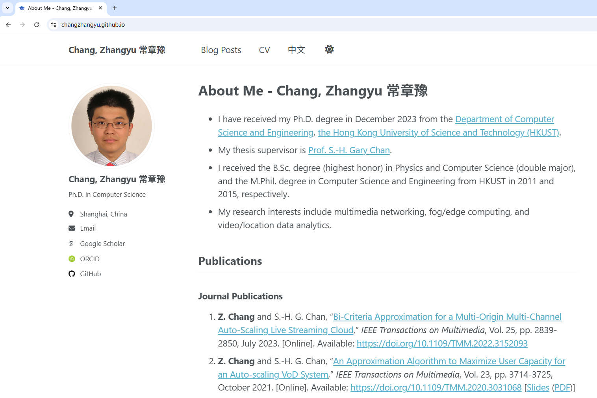

# Academic Pages

**Academic Pages is a GitHub Pages template from [academicpages/academicpages.github.io](https://github.com/academicpages/academicpages.github.io) for personal and professional portfolio-oriented websites.**

1. [General Information](https://academicpages.github.io/)
2. [Guidelines on How to Use It](https://academicpages.github.io/markdown/): Including locations of key files/directories.
3. [Academicpages usage guide in Chinese 中文使用指南](https://chunkitlau.github.io/posts/2022/02/academicpages-usage-guide/)
4. [Terms and Privacy Policy](https://academicpages.github.io/terms/)

## Locations of key files/directories

* Single pages: `_pages/`
  * Index page: `_pages/about.md`
  * CV in English: `_pages/cv.md`
  * CV in Chinese: `_pages/zh.md`

* Publications:
  * Journal publications: `_include/journal.md`
  * Conference publications: `_include/conference.md`
  * Other publications: `_include/other_publication.md`

* Blog posts are .md or .html files in `_posts/`
  * File names shall follow the pattern `yyyy-mm-dd-[postname].md` or `yyyy-mm-dd-[postname].html`
